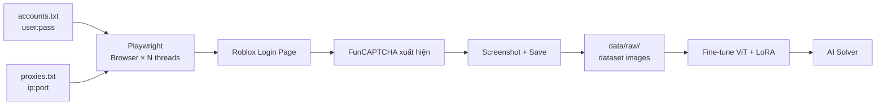

# 🧠 FunCAPTCHA Solver — Roblox Edition

Pipeline huấn luyện AI giải **FunCAPTCHA trên Roblox** bằng **Fine-Tuning ViT + LoRA** và **Classification**.

> ⚠️ **API (`noverify.py`) KHÔNG thể trích xuất ảnh CAPTCHA** — FunCAPTCHA render bằng JavaScript trong browser.
> → Dùng **Playwright multi-thread + proxy** để mở browser, login, và chụp ảnh CAPTCHA làm dataset.

---

## 🎯 Cách thu thập dataset



### So sánh 2 cách tiếp cận

|                      | API (`noverify.py`)                          | Browser (Playwright)              |
| -------------------- | -------------------------------------------- | --------------------------------- |
| **Lấy ảnh CAPTCHA?** | ❌ Không — API trả về metadata, không có ảnh | ✅ Có — chụp trực tiếp từ browser |
| **Dùng proxy**       | 1 proxy / request                            | 1 proxy / browser instance        |
| **Tốc độ**           | Nhanh (HTTP request)                         | Chậm hơn (render page)            |
| **Dùng làm dataset** | ❌ Không thể                                 | ✅ **Đây là cách đúng**           |

---

## 🏗️ Cấu trúc dự án

```
funcap/
├── src/funcap_solver/
│   ├── config.py                  # Cấu hình pipeline
│   ├── data/
│   │   ├── dataset.py             # PyTorch Dataset + Augmentation
│   │   ├── collector.py           # Collector chung (web bất kỳ)
│   │   └── roblox_collector.py    # ⭐ Roblox-specific: multi-browser + proxy
│   ├── models/
│   │   └── model.py               # ViT + LoRA (classify + angle dual-head)
│   ├── training/
│   │   └── trainer.py             # Training loop, AMP, early stopping
│   ├── inference/
│   │   └── solver.py              # End-to-end solver
│   ├── utils/
│   │   └── metrics.py             # Classification + Angle metrics
│   └── train.py                   # CLI entry point
├── notebooks/
│   └── funcap_training_colab.ipynb
├── noverify.py                    # Roblox email updater (API, không dùng cho CAPTCHA)
├── data/raw/                      # Dataset ảnh CAPTCHA
├── checkpoints/                   # Model checkpoints
└── pyproject.toml
```

---

## 🚀 Quick Start

### 1. Cài đặt

```bash
pip install -e .
pip install playwright && playwright install chromium
```

### 2. Thu thập dataset từ Roblox

Chuẩn bị 2 file:

**`accounts.txt`** — tài khoản Roblox (username:password):

```
user1:pass123
user2:pass456
user3:pass789
```

**`proxies.txt`** — proxy (ip:port hoặc user:pass@ip:port):

```
user:pass@192.168.1.1:8080
user:pass@192.168.1.2:8080
192.168.1.3:3128
```

```bash
# Chạy collector — 5 browser cùng lúc, mỗi browser 1 proxy
python -m funcap_solver.data.roblox_collector \
  --accounts accounts.txt \
  --proxies proxies.txt \
  --threads 5 \
  --output data/raw
```

> Mỗi browser mở → vào Roblox login → điền user/pass → bấm Login → **FunCAPTCHA xuất hiện** → screenshot → lưu vào `data/raw/<username>/`.

### 3. Huấn luyện

```bash
# Combined model (phân loại loại puzzle + dự đoán góc xoay)
python -m funcap_solver.train --mode combined --epochs 20 --batch-size 16

# Hoặc trên Google Colab
# Mở notebooks/funcap_training_colab.ipynb
```

### 4. Inference

```python
from PIL import Image
from funcap_solver.inference.solver import FunCaptchaSolver

solver = FunCaptchaSolver("checkpoints/best_model.pt")
result = solver.solve(Image.open("captcha.png"))
# => {"puzzle_type": "rotate_animal", "angle": 45.0, "cls_confidence": 0.95}
```

---

## 🧩 Các loại FunCAPTCHA trên Roblox

| Index | Loại Puzzle     | Dấu hiệu nhận biết                   |
| ----- | --------------- | ------------------------------------ |
| 0     | `rotate_animal` | "Rotate the animal to face upright"  |
| 1     | `match_object`  | "Match the object to its silhouette" |
| 2     | `select_tiles`  | "Select all tiles containing..."     |
| 3     | `shadow_match`  | "Match the shadow to the object"     |
| 4     | `pick_image`    | "Pick the correct image"             |
| 5     | `count_objects` | "How many... in this image?"         |

---

## 🛠️ Kiến trúc Model

```
                   ┌─────────────────────────┐
                   │   ViT-B/16 (LoRA fine-tune)  │
                   │   Chỉ train ~1% params       │
                   └────────────┬────────────┘
                                │
                 ┌──────────────┴──────────────┐
                 │                             │
        ┌────────▼────────┐          ┌────────▼────────┐
        │ Classification  │          │  Angle Head     │
        │ Head (6 classes)│          │  (360 bins)     │
        └────────┬────────┘          └────────┬────────┘
                 │                             │
        "rotate_animal"                   45.0°
```

---

## 📝 License

MIT
